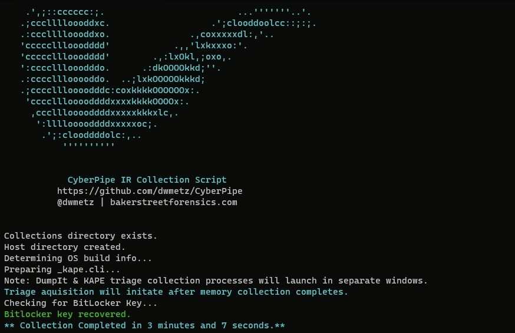

 
 

  <h2>
   CyberPipe
  </h2>
  <h5>
      An easy to use PowerShell script to collect memory and disk forensics for DFIR investigations.
   </h5>

 

  
  

  <h5>
   Functions:
  </h5>

- :ram: Capture a memory image with DumpIt for Windows,
- :computer: Capture a triage image with KAPE,
- :closed_lock_with_key: Check for encrypted disks,
- :key: Recover the active BitLocker Recovery key,
- :floppy_disk: Save all artifacts, output, and audit logs to USB or source network drive.
<h5>
   Prerequisites:
</h5>

>- [MAGNET DumpIt for Windows](https://www.magnetforensics.com/resources/magnet-dumpit-for-windows/)
>- [KAPE](https://www.sans.org/tools/kape)
>- DumpIt.exe (64-bit) in /modules/bin
>- DumpIt_arm.exe (DumpIt.exe ARM release) in /modules/bin
>- (optional) DumpIt_x86.exe (DumpIt.exe x86 release) in /modules/bin
>- [Encrypted Disk Detector](https://www.magnetforensics.com/resources/encrypted-disk-detector/) (EDDv310.exe) in /modules/bin/EDD
>- Prior to v4, the script required specific folder configurations in place (Collections folder, Memory folder, KAPE, etc.) That’s been simplified now. Just sit `CyberPipe.ps1 `next to your KAPE directory (whether on network or USB) and the script will take care of any folder creation necessary.
<h4>
   v4.0 Features: “One Script to Rule them All”
</h4>

>- Admin permissions check before execution.
>- Memory acquisition will use Magnet DumpIt for Windows (previously used Magnet RAM Capture).
>- Support for x64, ARM64 and x86 architectures.
>- Both memory acquistion and triage collection now facilitated via KAPE batch mode with `_kape.cli` dynamically built during execution.
>- Capture directories now named to `$hostname-$timestamp` to support multiple collections from the same asset without overwriting.
>- Alert if Bitlocker key not detected. Both display and (empty) text file updated if encryption key not detected. 
>- If key is detected it is written to the output file.
>- More efficient use of variables for output files rather than relying on renaming functions during operations.
>- Now just one script for Network or USB usage. Uncomment the `“Network Collection”` section for network use.
>- `Stopwatch` function will calculate the total runtime of the collection. 
>- ASCII art `“Ceci n’est pas une pipe.”`

<h5>
   Network Collections:
</h5>

> In the provided code, a network location of \\Server\Triage can be seen. This should be changed to reflect the specifics of your environment. Your KAPE folder will exist under this directory.
>>
>Permission requirements for said directory will be dependent on the nuances of the environment and what credentials are used for the script execution (interactive vs. automation).
>
For a walkthrough of the code visit [BakerStreetForensics](https://bakerstreetforensics.com/2023/01/16/kape-batch-mode-arm-memory-updates-to-csirt-collect-and-all-the-things-i-learned-along-the-way/).

Note: this script was previously titled CSIRT-Collect. Project name and repo updated with version 4.0.

