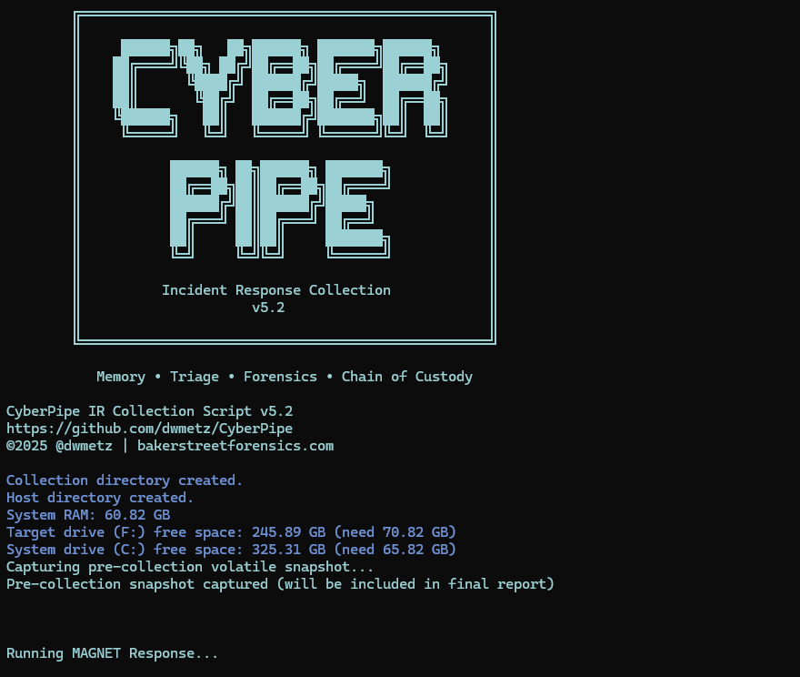

<div align="center">
 
 <p>
  <h2>
    CyberPipe v5.2
  </h2>
  <h6>
  (formerly CSIRT-Collect)
  </h6>

  <h5>
      An easy to use PowerShell script to collect memory and disk forensics for DFIR investigations.
   </h5>
<p>
<p>
 </div>
<div align="center">
  
  <div align="left">
  <h5>
   Functions:
  </h5>

- :ram: Capture a memory image with MAGNET DumpIt (supports x86, x64, and ARM64) or MAGNET RAM Capture for legacy systems.
- :computer: Collect triage data using MAGNET Response CLI, with selectable profiles or custom options.
- :closed_lock_with_key: Detect full disk encryption using MAGNET Encrypted Disk Detector.
- :key: Recover BitLocker Recovery Keys from all encrypted volumes.
- :floppy_disk: Store collected data, logs, and memory images to a USB device or a defined network location.
- :chart_with_upwards_trend: Real-time progress monitoring during collection.
- :page_facing_up: Comprehensive reporting with pre-collection volatile data and integrity hashes.

Collection profiles include:
- **QuickTriage** - Volatile + System Files (no RAM) - completes in ~2 minutes
- **Volatile** - Only volatile data (network connections, registry, running processes)
- **RAMOnly** - Memory dump only
- **RAMPage** - RAM + Pagefile
- **RAMSystem** - RAM + Critical System Files
- **Default (Full Triage)** - RAM + Pagefile + Volatile + System Artifacts

<h5>
   Prerequisites:
</h5>

>- [MAGNET Response](https://www.magnetforensics.com/resources/magnet-response/)
>- [MAGNET Encrypted Disk Detector](https://www.magnetforensics.com/resources/encrypted-disk-detector/) 


<h5>
Network Collections:
</h5>

CyberPipe supports saving output directly to a network share using the `-Net` parameter. Simply specify the UNC path (e.g., `\\server\share`) and the script will automatically map the network drive and perform the collection. This is ideal for automated DFIR workflows triggered by EDR or SOC alerts.

```powershell
.\CyberPipe.ps1 -Net "\\server\share"
```


<h5>
New in 5.2:
</h5>

**Intelligent Collection**
- Dual disk space validation (target + system drives) with profile-aware requirements
- Pre-collection volatile snapshot (uptime, users, connections, processes)
- Virtual environment detection (VMware, Hyper-V, VirtualBox, etc.)
- Real-time progress indicator with accurate size tracking

**Enhanced Capabilities**
- QuickTriage profile for rapid collections
- BitLocker key recovery from ALL volumes (not just C:)
- Comprehensive single-file reporting (CyberPipe-Report.txt)
- SHA256 integrity hashing for chain of custody
- Optional compression with `-Compress` flag
- Network collection mode via `-Net` parameter (no manual editing required)

**Improved Reliability**
- Profile-aware disk space checks prevent silent failures
- MAGNET Response exit code validation
- Post-collection artifact verification
- Better error handling and messaging


<h5>
Usage Examples:
</h5>

- **Run full triage (default collection profile) to local USB drive:** (RAM, Pagefile, Volatile, System Files)
  ```powershell
  .\CyberPipe.ps1 
  ```

- **Run RAM & Operating System Files (triage light) capture:**
  ```powershell
  .\CyberPipe.ps1 -CollectionProfile RAMSystem
  ```
- **Run memory-only capture:**
  ```powershell
  .\CyberPipe.ps1 -CollectionProfile RAMOnly
  ```

 
- **Run RAM & Pagefile capture:**
  ```powershell
  .\CyberPipe.ps1 -CollectionProfile RAMPage
  ``` 

- **Run RAM & Operating System Files (triage light) capture:**
  ```powershell
  .\CyberPipe.ps1 -CollectionProfile RAMSystem
  ```
- **Run volatile-only capture:**
  ```powershell
  .\CyberPipe.ps1 -CollectionProfile Volatile
  ```

- **Run quick triage (fast collection):**
  ```powershell
  .\CyberPipe.ps1 -CollectionProfile QuickTriage
  ```

- **Run full triage with compression:**
  ```powershell
  .\CyberPipe.ps1 -Compress
  ```

- **Run collection to network share:**
  ```powershell
  .\CyberPipe.ps1 -Net "\\server\share"
  ```

- **Run network collection with specific profile:**
  ```powershell
  .\CyberPipe.ps1 -Net "\\server\share" -CollectionProfile QuickTriage
  ```

- **Run network collection with compression:**
  ```powershell
  .\CyberPipe.ps1 -Net "\\server\share" -Compress
  ```

- _You can modify or create custom profiles by specifying CLI arguments supported by MAGNET Response._

<h5>
Tool Directory Structure:
</h5>

- **USB Collections:** The `Tools` directory should be located alongside the script:
  ```
  E:\Triage\CyberPipe\CyberPipe.ps1
  E:\Triage\CyberPipe\Tools\
  ```

- **Network Collections:** The `Tools` directory should be placed in the root of the network share:
  ```
  \\Server\share\Tools\
  ```

<h5>
   Prior version (KAPE support):
</h5>

If you previously used CyberPipe with KAPE (prior to v5), the older workflow remains available in `CyberPipe.v4.01.ps1`.

> Note: CyberPipe was previously known as CSIRT-Collect. The project was renamed starting with version 4.0.

For more information visit [Baker Street Forensics](https://bakerstreetforensics.com/?s=cyberpipe)
